Low-code**日志监控预警系统**

目录

[1. 前言 1](#_Toc65162049)

>   [1.1 概述 1](#_Toc65162050)

>   [1.2 工作流程 1](#_Toc65162051)

>   [1.3 适用场景 1](#_Toc65162052)

[2. 功能概述 2](#_Toc65162053)

[3. 快速入门 3](#_Toc65162056)

>   [3.1 数据源管理 3](#_Toc65162058)

>   [3.2 创建监控任务 3](#_Toc65162059)

>   [3.2.1 监控任务概述 4](#_Toc65162060)

>   [3.2.2 新建任务 4](#_Toc65162061)

>   [3.2.3 数据源配置 5](#_Toc65162062)

>   [3.2.4 数据清洗配置 5](#_Toc65162063)

>   [3.2.5 数据集配置 6](#_Toc65162064)

>   [3.2.6 监控处理任务管理 9](#_Toc65162065)

>   [3.3 报警管理 9](#_Toc65162066)

>   [3.3.1 报警联系人列表 9](#_Toc65162067)

>   [3.3.2 新建报警 10](#_Toc65162068)

>   [3.3.3 报警任务管理 10](#_Toc65162069)

>   [3.3.4 报警故障统计 11](#_Toc65162070)

>   [3.3.5 报警明细 12](#_Toc65162071)

>   [3.3.6 报警任务管理 12](#_Toc65162072)

>   [3.4 异常管理 12](#_Toc65162073)

>   [3.4.1 异常模板管理 12](#_Toc65162074)

>   [3.4.2 异常过滤管理 14](#_Toc65162075)

>   [3.4.3 异常日志明细 15](#_Toc65162076)

>   [3.4.4 异常日志列表 15](#_Toc65162077)

>   [3.5 可视化清洗 16](#_Toc65162078)

>   [3.5.1 自定义洗清 16](#_Toc65162079)

>   [3.5.2 内置切分器 20](#_Toc65162080)

# 1、前言

## 1.1、概述

日志监控预警系统
RigEye是一款可视化代码日志监控产品,。借助本产品，您可以基于前端、应用、业务日志可视拖拽搭建积木方式,对采集到的日志进行实时ETL，并保到时序数据库中，最后通过配置方式定义多维度预警指标，迅速便捷地为企业构建实时响应的日志监控能力。

## 1.2、工作流程

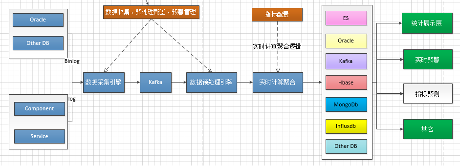

-   数据收集：RigEye 支持通过配置从 KAFKA上抓取日志。

-   任务定义：

    -   通过任务配置来定义实时处理、数据存储、展示分析、数据 API
        和报警等任务，从而定义出自己的应用场景。

    -   通过应用日志监控等预设场景直接进行业务监控。

## 1.3、适用场景

-   业务深度定制监控：可按需深度定制具备业务属性的实时监控报警。业务场景包括交易场景、资讯场景、风控场景等。

-   业务异常监控：对分布式应用进行异常监控。

-   统一报警和指标监控报表平台：统一报警和指标监控。

# 2、功能概述

RigEye
产品提供一系列监控定制功能，包括数据接入、数据计算、数据存储、大盘展示和报警，以及下游对接等环节。

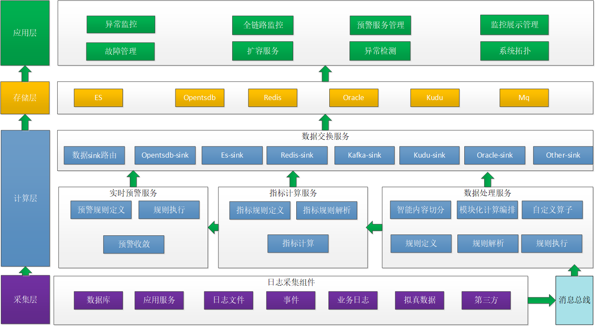

>   各功能描述如下：

-   灵活的实时计算任务定义

    -   支持拖拽式的实时计算模块化编程，支持绝大多数语言逻辑，如通用数学计算、正则匹配、if/else
        等。

    -   丰富的实时计算和存储算子支持，包括 Sum、Count、Max/Min、环比等。

-   稳定高效的时序和事件存储

-   在线持续聚合数据，保证数据容量可控。

-   支持二级的下钻索引。

-   可定制的报警设置

-   支持设置任意连续时间的滑动平均、最大值报警。

    -   丰富的报警通道，如邮件、短信、微信等。

-   灵活的预警大盘定制

-   丰富的展示控件，如柱线图、热力图、饼图、翻牌器等。

    -   支持大盘共享、全屏展示等。

-   灵活对接各类下游应用

-   清洗后的数据可实时回送到kafka供下游业务使用。

# 3、快速入门

## 3.1、数据源管理

>   日前监控平台所有数据均来源于kafka,所以创建监控任务前必须创建任务数据来源

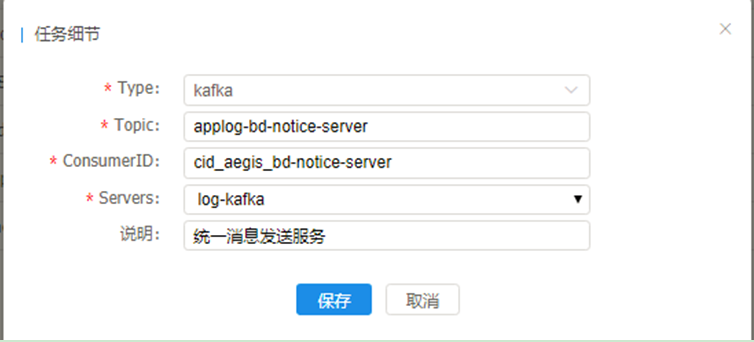

>   Type:默认kafka

>   Topic:输入需要监控的数据来源于哪个topic

>   Java自研应用日志topic命名规范是：applog-项目模块名

>   ConsumerID:待创建的监控任务消费组id，命名规范:cid_RigEye\_项目名

>   Servers:kafka集群列表（目前所有日志类数据全在log-kafka集群）

## 3.2、创建监控任务

>   本文介绍了创建自定义监控任务的第一个步骤：配置数据源。在准备好数据源后，需要在
>   RigEye 控制台进行简单的配置。

**流程导航**

>   点击以下流程图可跳转至相关步骤的文档。

### 3.2.1监控任务概述

>   任务配置流程，包含数据源配置、日志清洗、数据集与报警配置三个步骤。在数据集与报警配置步骤中，您可以根据需要进行不同的配置。

#### **3.2.2 新建任务**

>   在控制台左侧导航栏中选择**监控处理任务-\>新建任务**

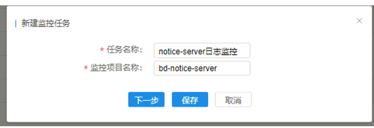

>   任务名称：为用户自定义的任务名称，名称必须唯一，建议命名规则：项目名+任务说明。

>   监控项目名称：显示用户cmdb中归属的项目列表。

>   下一步：点击下一步自动进入后继配置。

>   保存：点击保存回到监控任务管理列表。

#### 3.2.3 数据源配置

>   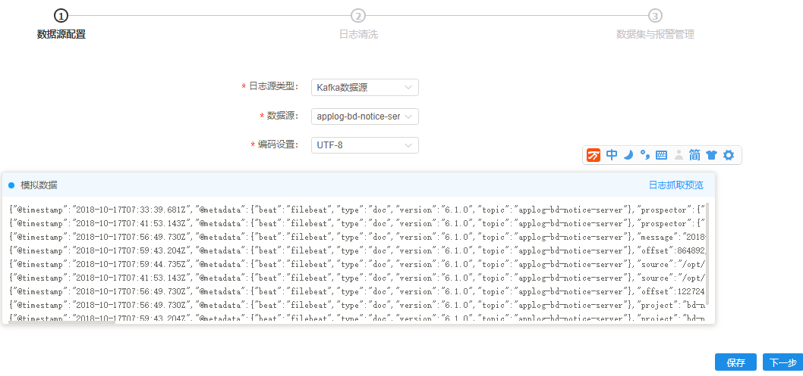

>   **日志源类型**：默认kafka数据源

>   **数据源**：选择在3.2中创建的待监控数据所在topic

>   **编码设计**：默认UTF-8

>   **日志抓取预览**：从选择的数据源topic中抓取一批数据供用户检查配置是否生效

>   **下一步**：进入下一步“数据清洗”配置

#### 3.2.4 数据清洗配置

数据清洗配置分三块区域：日志抓取结果区、定义切分规则区、日志切分预览区

>   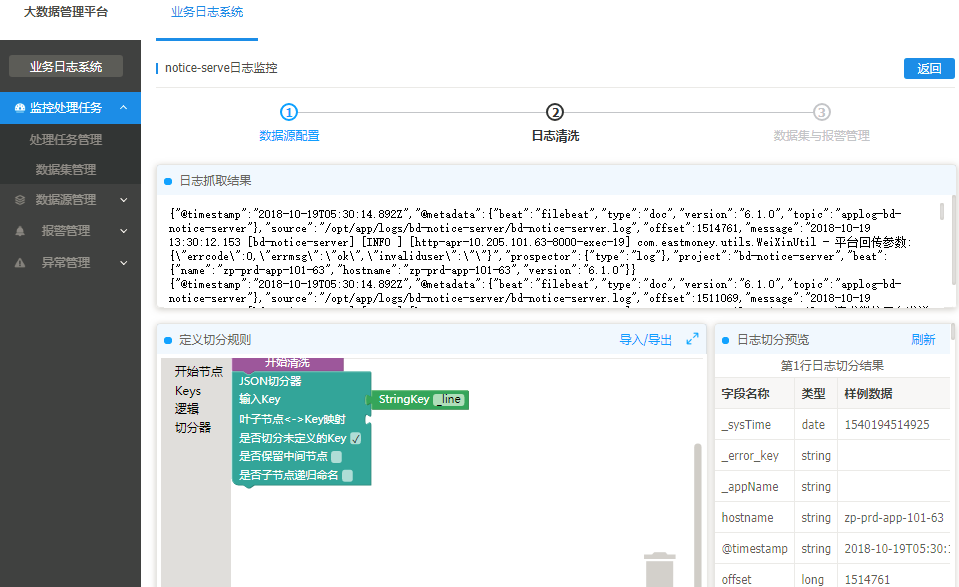

>   **日志抓取结果区**：存放上一步抓取到的原始日志

>   **定义切分规则区**：可视化数据清洗流程编排区，用户可以在该区域进行灵活的数据清洗逻辑编码

>   导入：可以导入其他相同清洗规则的脚本，节省清洗规则的编排时间

导出：可以导出洗清规则脚本供其他监控任务使用

>   **日志切分预警区**：可以根据编排的切分规则进行实时预览切分后的结果，用于对切分规则逻辑正确与否的效验

#### 3.2.5 数据集配置

>   数据集配置分为五块区域：切分模型区、数据集区、异常检测区、明细数据目标地配置区、设置任务运行资源区

>   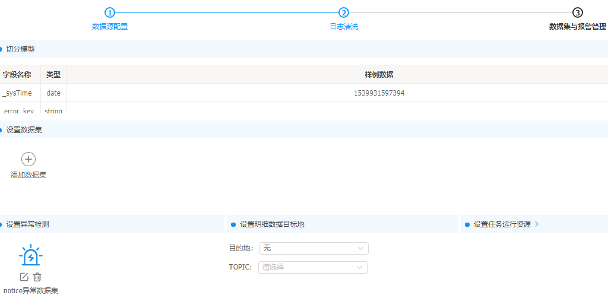

>   **切分模型**：显示上一步切分预览中的结果模型

>   **设置数据集**：数据集管理区域

>   **设置异常检测**：设置异常检测数据集，主要针对日志中的异常关键字做模糊匹配识别，每个监控任务只能添加一个异常检测数据集

>   **设置明细数据目标地**：该区别可以设置清洗后的数据输出给下游使用，目前只支持输出到kakfa

>   **设置任务运行资源**：如果数据来源量比较大，可以自定义设置任务运行资源来提升任务处理能力

>   默认资源使用：2个worker 每个worker 1 cores+4G ; driver:1 cores+1G

##### 3.2.5.1设置数据集/异常检测

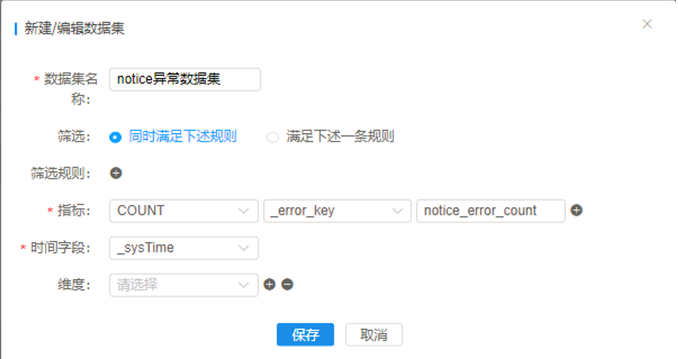

>   \*\*数据集名称：\*\*自定定义

>   **筛选：只有满足该筛选条件的数据集会被计算在内。注意：
>   同时满足下述规则对应且的关系，满足下述一条规则对应或的关系。**

>   **指标：** 一般为数字类型，是衡量目标的度量。RigEye 的指标对应于实时计算后的
>   Count、Max、Min、Sum。

>   \*\*时间字段：\*\*日志切分对应的时间字段，是实时监控的最基础维度。

>   \*\*维度：\*\*是衡量目标的思维角度。例如按班级统计学生人数，那么班级就是维度。相当于
>   SQL 语言中的GROUP BY。

#### 3.2.6 监控处理任务管理

>   

>   **监控项目名**：监控处理任务监控的cmdb中项目模块名列表

>   **监控状态**：对应列表中监控状态列，取值为正常、异常

>   **批量启动**：对用户选中的任务批量启动

>   **批量停止**：对用户选中的任务批量停止

>   **批量删除**：对用户选中的任务批量删除

列表字段说明：

>   状态：代表任务运行状态

>   数据集：代表任务需要聚合的数据集个数

>   监控状态：代表任务运行中是否有异常

>   浏览：查看任务详细

>   启动/停止：启动/停止任务

>   复制任务：当需要复制一个新任务时使用

## 3.3 报警管理

### 3.3.1 报警联系人列表

>   报警联系人列表显示所有项目模块预警联系人，数据是手工点击\<信息同步\>从cmdb中同步过来的，未来会做成实时同步。该列表数据用于报警任务中的报警通知人。

### 3.3.2 新建报警

>   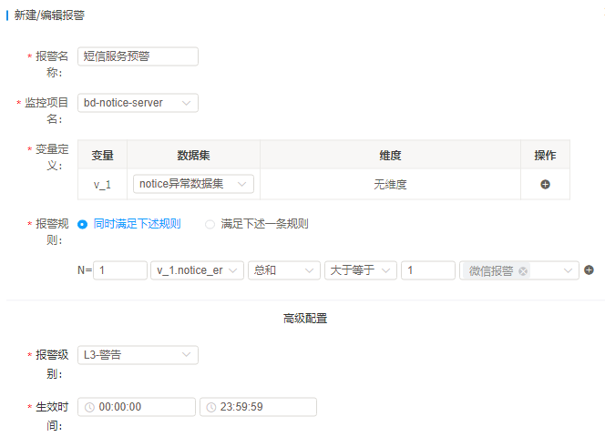

>   **报警名称**：自定义报警名称，建议项目名+描述

>   **监控项目名：下拉选择在3.2.2里选择监控的任务**

>   **变量定义**：支持多个变量定义，用于数据集的筛选

>   变量:系统自动生成变量标识，生成规则是v\_数字，用于区分不同的变量

>   数据集：选择在3.2.5中创建的数据集(包括异常检测数据集)

>   维度:数据集筛选条件

>   **报警规则：N=代表分钟,上图规则描述为间隔1分钟系统判断v_1.notice_error_count指标总和大于等1就触发微信报警**

>   **报警级别：下拉选择报警级别，默认是L3-警告**

>   **生效时间：预警任务生效时间范围，范围外不会发送任务报警消息，但会在\<报警故障统计\>和\<报警历史明细\>中显示**

>   说明：目前相同报警消息发送间隔是10分钟，报警恢复间隔1分钟

### 3.3.3 报警任务管理

>   显示所有新建的报警任务，新建完成的报警任务需要点击”**启动**”按钮后报警任务才能生效

>   

### 3.3.4 报警故障统计

>   报警故障统计是对报警明细的实时按天统计，使用研发人员更方便了解自己负责项目的报警情况

>   

>   报警日期：报警产生日期

>   监控项目名：3.2.2中选中的监控项目模块名

>   报警等级：3.3.2中新建报警时选择的报警级别

>   报警任务名称：3.3.2中新建报警时输入的报警任务名称

>   触发报警规则描述：3.3.2中配置的报警规则

>   报警数量：略

>   报警明细：点击查看3.3.5中具体报警明细

>   监控大盘：点击查看指定报警日期的系统监控图表，包括cpu、内存、磁盘

### 3.3.5 报警明细

>   

### 3.3.6 报警任务管理

>   显示所有新建的报警任务，新建完成的报警任务需要点击”**启动**”按钮后报警任务才能生效

>   

## 3.4 异常管理

### 3.4.1 异常模板管理

>   异常模板管理功能主要是配合3.2.5.1节添加的“设置异常检测”服务的，异常检测会基于在此处添加的异常关键字（正则）对日志进行模糊匹配，匹配中了会将异常模板名称插入3.2.3节数据洗清出来的系统字段\_error_key字段中，这样在3.2.5.1中的“设置异常检测”数据集时，就可以基于\_error_key字段做异常统计，同时将匹配中的日志插入\<异常日志明细表\>供后继分析

>   

#### **3.4.1.1添加异常模板**

>   下图配置说明：对所有监控项目日志中null关键字做检测

>   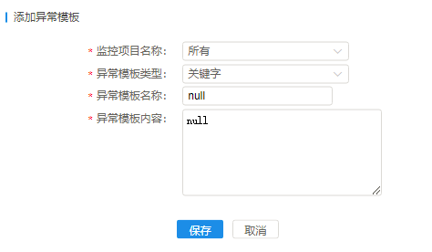

>   监控项目名称：3.2.2中选择的项目模块名列表

>   异常模板类型：异常模板分关键字和正则匹配两类

>   异常模板名称：用于描述异常模板的名称

>   异常模板内容：用于异常检测的内容，包括关键字或正则匹配，大小写敏感

>   说明：

1.  exception和error系统默认异常关键字，忽略大小写，并对所有项目生效

    2、异常模板新增/修改后需要重启3.2.6列表中的监控任务才能生效

### 3.4.2 异常过滤管理

异常过滤管理主要用于对添加的全局异常模板做过滤

>   

#### **3.4.2.1添加异常过滤模板**

下图说明：忽略bd-hgla-manage中null异常关键字，当bd-hgla-manage日志中出现null关键字时不记录到\_error_key异常统计

>   

>   监控项目名称：在3.2.2中添加的监控项目模块名称

>   过滤模板名称：在3.4.1.1中添加的异常异常模板名称

>   说明：异常过滤模板新增/修改后需要重启3.2.6列表中的监控任务才能生效

### 3.4.3 异常日志明细

异常日志明细数据来源于3.2创建的监控任务，监控任务一旦发现项目日志中存在3.4.1.1中添加的相关项目关键字，则插入一条记录到异常日志明细

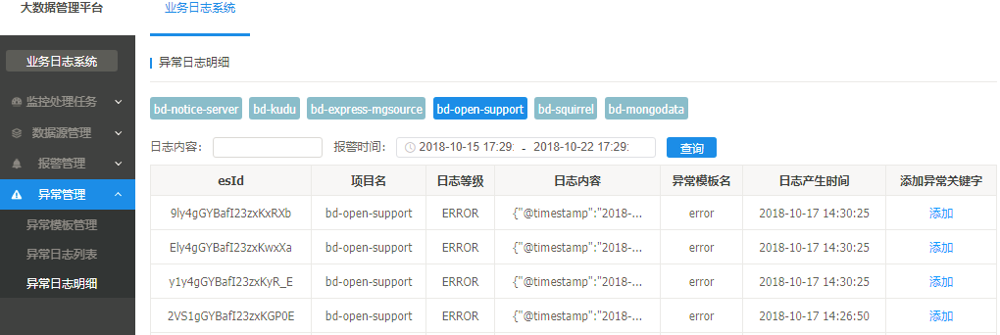

Esid:明细日志在es中的id

项目名：监控的项目模板名

日志等级：3.2.4中数据清洗配置中从日志切分出来的日志等级，如果为空则代表没有切分该字段

日志内容：从kafka消费出来的原始日志供问题分析用

异常模板名：为匹配上的异常模板名

日志产生时间：为3.2.4中切分出来的 @timestamp时间

添加异常关键字：当发现日志内容中有需要新增的异常关键字时，可以点击此快捷按钮添加

### 3.4.4 异常日志列表

>   异常日志列表是对上面异常日志明细的按天聚合统计

>   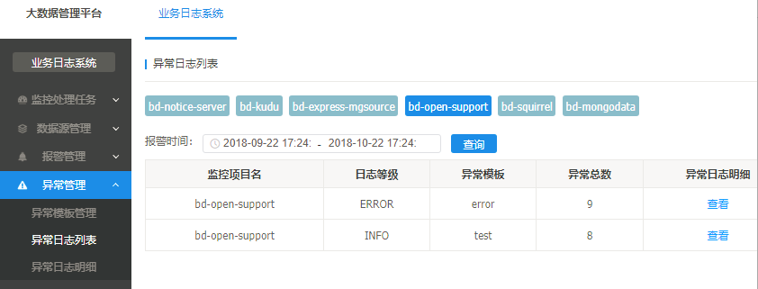

## 3.5可视化清洗

### 3.5.1 自定义洗清

>   数据清洗界面分三块区域：原始日志区、可视化清洗流程编排区、清洗结果预览区

>   

>   在可视化清洗流程编排区（以下简称“编排区”），支持使用一个或多个“积木”拼装出日志清洗的逻辑，将原始日志区中的日志“清洗”成结构化的键值对（Key-Value
>   Pair）。

>   在编排区编辑的过程中，支持随时单击清洗结果预览区域上方的日志切分预览按钮，预览每一行原始日志通过当前编排区的流程清洗后的键值对结果。

>   说明：为配合系统后续查询，切分规则中请配置一个@timestamp的时间戳字段，否则后续查询功能将不能使用。另外，切分结果中内置了下划线开头的字段：\_sysTime、\_error_key、\_appName、\_line，所以配置key时请不要使用这些内置key名称。

| 系统字段名  | 值                             |
|-------------|--------------------------------|
| \_sysTime   | 系统时间                       |
| \_error_key | 异常模板名称（不是异常模板值） |
| \_appName   | 项目名称                       |
| \_line      | 一条日志                       |

**示例一**

>   本示例演示如何配置一个简单的日志清洗流程。

>   假如某系统的交易日志如下：

>   2018-10-08 11:00:01\|evan\|170794\|登录

>   2018-10-08 11:00:02\|evan\|170794\|发贴

>   2018-10-08 11:10:01\|evan\|170794\|回贴

>   以第一行数据为例，假设目标切分结果为如下几个键值对：

| **Key 类型** | **Key**    | **Value**           |
|--------------|------------|---------------------|
| Date         | @timestamp | 2018-10-08 11:00:01 |
| String       | username   | evan                |
| Long         | userid     | 170794              |
| String       | event      | 登录                |

>   通过观察发现，键值对之间均使用竖线（\|）进行分隔，因此可以使用**单分隔符切分器**来切分键值对。

1.  在编辑区左侧的工具栏中，将**单分隔符切分器**拖拽至编辑区，如下图所示。

    **注意：切分器必须连接在开始清洗**模块下才能生效。

    

    配置切分说明：

    l 以“\|”为分隔符，“_line”作为入参（\_line 代表原始日志行本身)。

    l 切分后，0 号位置的字符串按照 yyyy-MM-dd HH:mm:ss 的格式转为 date。

    l 1 号位置的字符串转为 key 为 username 的 String。

    l 2 号位置转为 key 为 userid 的 Long。

    l 3 号位置保存为 key 为 event 的 String。

2.  点击**日志切分预览**，可以观察到每行日志的切分结果如下：

    

    最终生成的切分模型如下所示：

    

3.  单击**保存**或**下一步**，清洗流程生效。

    到此为止，一个简单日志切分就完成了。

### 3.5.2 内置切分器

#### 3.5.2.1 单分隔符切分器

>   **说明**

>   将单一字符串作为输入，当匹配到用户指定的分隔字符串时进行切分，切分结果为多个键值对（Key-Value）。

>   **示例**

>   样例日志：

>   2018-10-08 11:00:01\|evan \|170794\|买入

>   2018-10-08 11:10:01\|evan\|170794\|卖出

>   自定义切分逻辑：

>   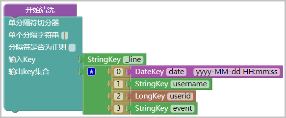

>   切分逻辑说明：

-   以竖线（\|）为分隔符，以 \_line 作为入参（\_line 代表原始日志行本身）。

-   切分后 0 号位置的字符串按照 yyyy-MM-dd HH:mm:ss 的格式转为 date
    （内部实际将以 Long 型保存）。

-   1 号位置的字符串转为以 username 为 Key 的字符串。

-   号位置转为以 userid 为 Key 的 Long。

-   号位置转为以 event 为 Key 的字符串。

    **注意：**

-   多字符分隔符：本切分器分隔符可以是多字符。例如以 a::b::c 为输入，以 ::
    为分隔符切分。

#### 3.5.2.2 多分隔符切分器

>   **说明**

>   将单一字符串作为输入，当匹配到用户指定的任意一个分隔字符串时进行切分，切分结果为多个键值对（Key-Value）。

>   **示例**

>   样例日志：

>   2018-07-25 17:25:00,aaa\|b\~1

>   2018-07-25 17:26:00,aaa\|b\~1

>   自定义切分逻辑：

>   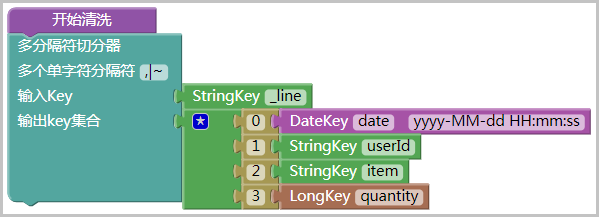

>   切分结果：

>   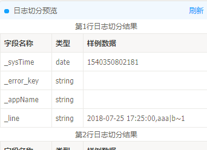

#### 3.5.2.3 顺序分隔符切分器

>   **说明**

>   对于较复杂的切分场景（例如 accesslog），可以使用 RigEye
>   的顺序分隔符切分器，以 O(n) 的复杂度切分日志。

>   **示例**

>   样例日志：

>   117.xx.xx.xx 835158 - [26 May 2014:14:05:28 +0800] "GET
>   http://www.xxxxxx.com/trade/detail/trade_snap.htm?spm=a1z0f.2.100003.9.8BpicQ&trade_id=664793864233811"
>   302 0

>   117.xx.xx.xx 835158 - [26 May 2014:14:05:28 +0800] "GET
>   http://www.xxxxxx.com/trade/detail/trade_snap.htm?spm=a1z0f.2.100003.9.8BpicQ&trade_id=664793864233811"
>   302 0

>   需要切分出的字段有：

-   IP：117.xx.xx.xx

-   平均响应时间：835158

-   时间：1401084328000

-   请求的
    URL：http://www.xxxxxx.com/trade/detail/trade_snap.htm?spm=a1z0f.2.100003.9.8BpicQ&trade_id=664793864233811

    RigEye 提供了顺序分隔符切分器，可以满足本示例的需求。切分逻辑：

    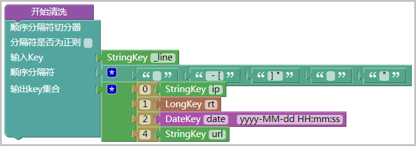

    切分逻辑说明：

    先定义了 5 个分隔符字符串，并依次将输入字符串切分为了 6
    段子串，随后将指定的子串分别赋给不同的 key，即可达到目标切分效果。

#### **3.5.2.4 KV 切分器**

>   **说明**

>   如果需要切分含有多组 KV 的日志，且各个 KV 的位置不固定时，可以使用 KV
>   切分器。

>   **示例 1**

>   样例日志：

>   key1=aaaa;key2=bbbb;key3=cccc;key4=dddd;....

>   key1=aaaa;key2=bbbb;key3=cccc;key4=dddd;....

>   切分逻辑：

>   

>   **注意：**

-   如果没有配置文本字符与 Key 的映射，KV 切分器将视所有 Key 为“未定义
    key”，所有 Key 对应的 Value 将被切分为 StringKey 类型。

-   如果选择取消勾选**是否切分未定义的 Key**，那么未定义 Key
    将不会被切分。换言之，如果没有配置文本字符与 Key
    的映射，并且未勾选**是否切分未定义的 Key**，则 KV 切分器将不做任何处理。

    **示例 2**

    以下是一个需要将指定 Key 转换成对应类型的示例：

    样例日志：

    name=abc;item=iphone6;quantity=15;date=2014-07-25 17:25:00;....

    name=abc;item=iphone6;quantity=15;date=2014-07-25 17:25:00;....

    目标是将 quantity 变为 LongKey，date 变为 DateKey。切分逻辑：

    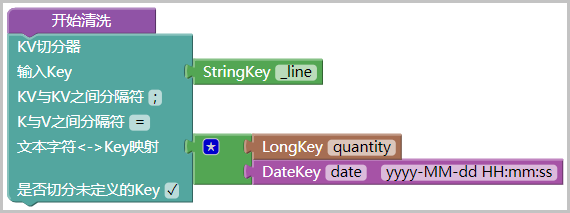

#### **3.5.2.5 JSON 切分器**

>   **说明**

>   如果日志中包含 JSON 字符串，使用 JSON 切分器可以快速切分出该 JSON
>   中的叶子节点。

>   **示例 1：全自动切分**

>   样例日志：

>   {"@timestamp":"2018-10-19T05:30:14.892Z","@metadata":{"beat":"filebeat","type":"doc","version":"6.1.0","topic":"applog-bd-notice-server"},"source":"/opt/app/logs/bd-notice-server/bd-notice-server.log","offset":1514761,"message":"2018-10-19
>   13:30:12.153 [bd-notice-server] [INFO ]
>   [http-apr-10.205.101.63-8000-exec-19] com.xxxxxx.utils.WeiXinUtil -
>   平台回传参数:{\\"errcode\\":0,\\"errmsg\\":\\"ok\\",\\"invaliduser\\":\\"\\"}","prospector":{"type":"log"},"project":"bd-notice-server","beat":{"name":"zp-prd-app-101-63","hostname":"zp-prd-app-101-63","version":"6.1.0"}}

>   将该 JSON 放在一行文本中，使用 JSON 切分器进行切分。切分逻辑：

>   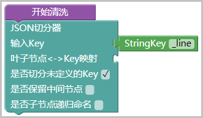

>   切分结果：

>   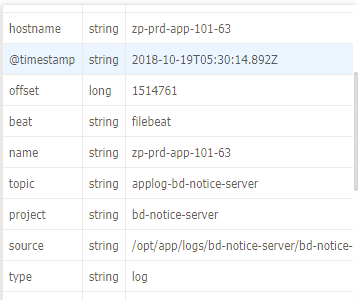
